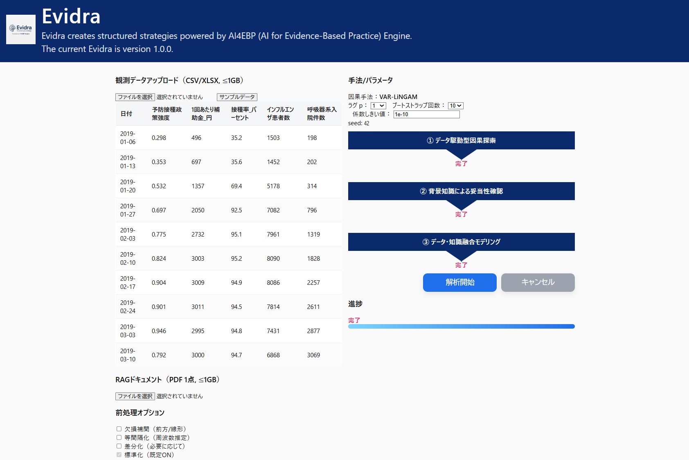
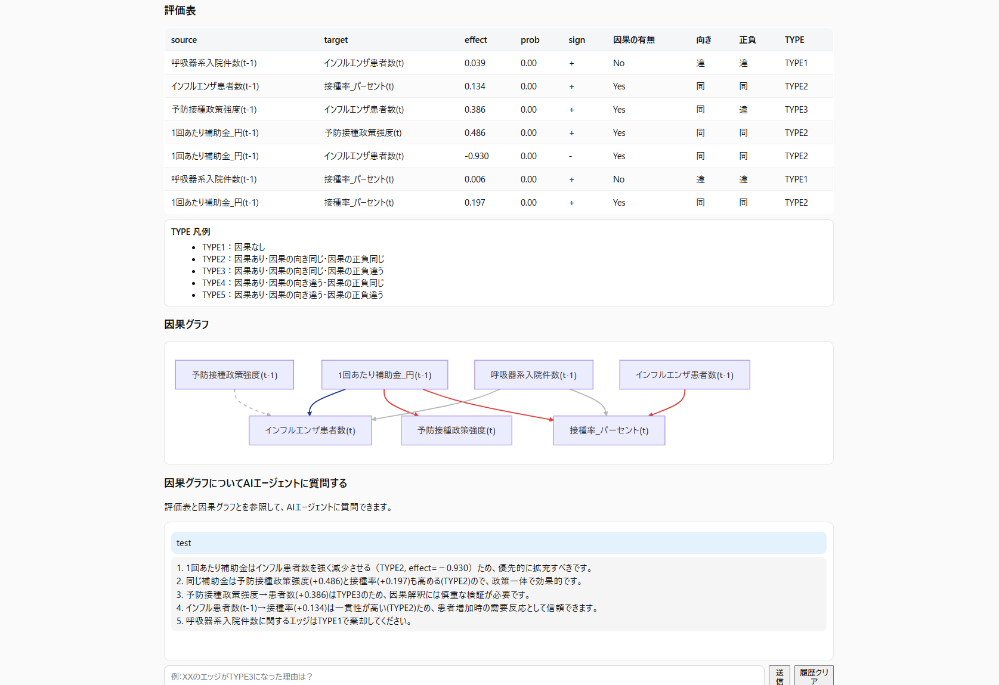
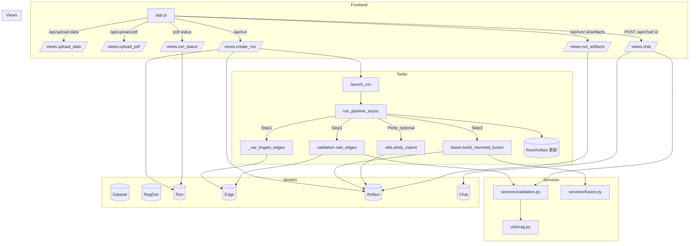

# Evidra
Evidra は「AI4EBP (AI for Evidence-Based Practice)」エンジンで、観測データから因果構造を推定し、背景知識（任意でRAG）で妥当性を評価、データ×知識の融合グラフを提示する Django 製 Web アプリです。
①データ駆動型因果探索→②背景知識による妥当性確認→③データ・知識融合モデリング の順で非同期に処理し、Step4 では因果グラフに関する QA（Azure OpenAI 対応）を行います。

## 1. 何ができるか（機能）
観測データアップロード（CSV/XLSX ≤1GB）
先頭行＝列名を前提に読み込み。日付列を自動推定して時系列整形。

### 因果探索
ラグ指定、係数のしきい値指定、MBB（Moving Block Bootstrap）で確率推定。内部で標準化（既定ON）。

### 妥当性確認
- RAGあり: アップロード PDF を Cosmos Vector Search で検索 → Azure OpenAI に JSON 評価
- RAGなし: LLM 単独評価（Azure OpenAI が無ければヒューリスティックでフォールバック）
出力: TYPE1～5 と citations を含む評価表

### 因果グラフ
Step2 の結果だけを使い、Mermaid でエッジをスタイリング（TYPE2だけ色分け）。
- TYPE2: 符号が 正=赤, 負=青
- TYPE1/3/4/5: 薄いグレー

### AI エージェント質問
因果エッジ一覧と評価結果を前提に Azure OpenAIで回答。履歴は Run と紐づけて保存。

### ステータス管理
「未実行→処理中→完了/失敗」をバックグラウンドで更新。キャンセル可。
監査ログ保持 24 時間。seed=42 で再現実行（Run Replay）。

## 処理フロー（ファイル/関数関係）

